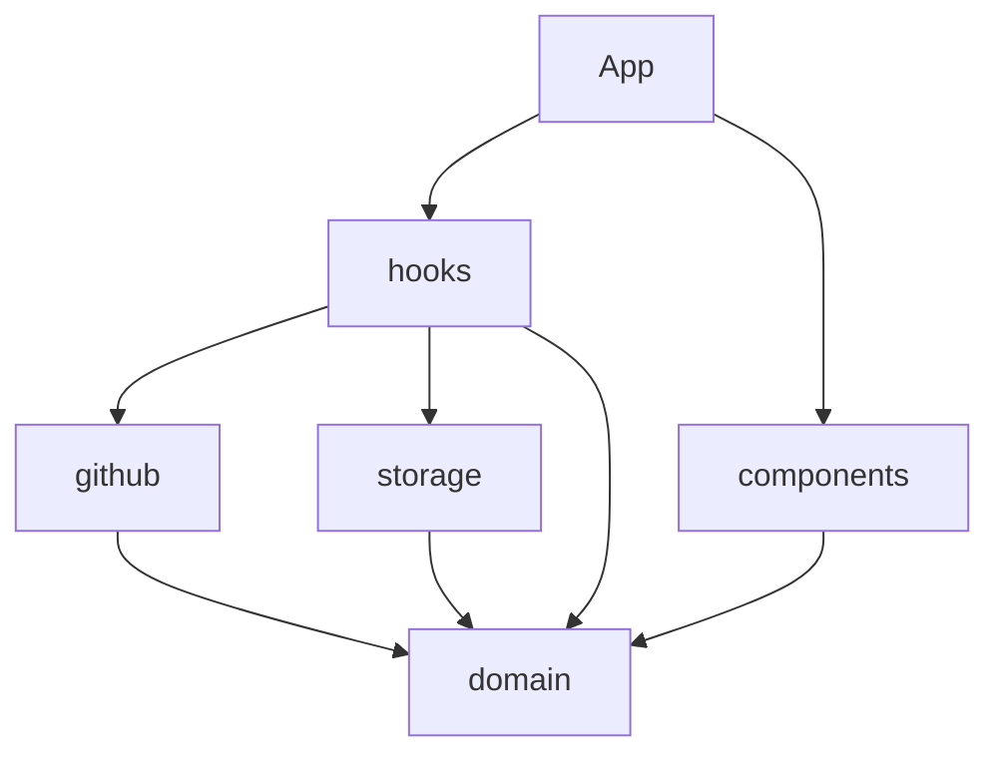

# Arquitetura — PR Network

App SPA sem backend. O browser fala direto com a GitHub GraphQL API; preferências e anotações ficam em `localStorage`.

## Camadas

| Pasta | Responsabilidade |
|-------|------------------|
| `domain/` | Tipos (`PullRequest`, …) e regras puras (filtros, `prKey`). Sem React, sem I/O. |
| `github/` | Adaptador remoto: cliente GraphQL, queries, mappers, search/repos, PAT. |
| `storage/` | Persistência local: notes, pins, layout de repos, backup, preferências UI. |
| `hooks/` | Orquestra estado React e chama `github` / `storage` / `domain`. |
| `components/` | UI apresentacional (recebe props). |
| `App.tsx` | Compõe hooks + layout shell. |

Dependências permitidas: UI → hooks/domain/storage; hooks → github/storage/domain; github/storage → domain. **Não** o contrário.



## Fluxo de dados

1. Usuário salva PAT (`github/token`) → `useAuth`.
2. `usePullRequests` busca repos + PRs (`github/repos`, `github/search`) conforme escopo e filtros de API.
3. `usePrFilters` aplica filtros locais + ordenação de pins (`domain/filters`).
4. Lista/drawer leem notes/pins de `useLocalWorkspace` (`storage/*`).
5. Backup exporta/importa um JSON versionado **sem** o PAT (`storage/backup`).

Filtros locais rodam **depois** do fetch: só enxergam PRs já carregados (incluindo páginas já pedidas com “Carregar mais”).

## Chaves `localStorage`

| Chave | Conteúdo |
|-------|----------|
| `gh_pat` | Personal Access Token (nunca no backup) |
| `pr-network-notes` | Mapa `{ "owner/repo#n": "texto" }` |
| `pr-network-pins` | Array de keys `"owner/repo#n"` |
| `gh_repo_layout` | Pastas, `folderByRepo`, `hidden` |
| `pr-network-sidebar-collapsed` | `"1"` / `"0"` |

## Backup (`version: 1`)

```json
{
  "version": 1,
  "exportedAt": "ISO-8601",
  "notes": {},
  "pins": [],
  "repoLayout": { "folders": [], "folderByRepo": {}, "hidden": [] },
  "sidebarCollapsed": false
}
```

Importação **substitui** notes/pins/layout/preferência de sidebar.

## Decisões

- Sem servidor próprio: PAT no cliente; escopos mínimos no README.
- SOLID pragmático: um módulo/hook por responsabilidade; sem container de DI.
- Testes só em lógica pura (`domain`, parse de backup) — Vitest.
- Markdown na descrição do PR (e preview das notas) via `react-markdown` + GFM.
