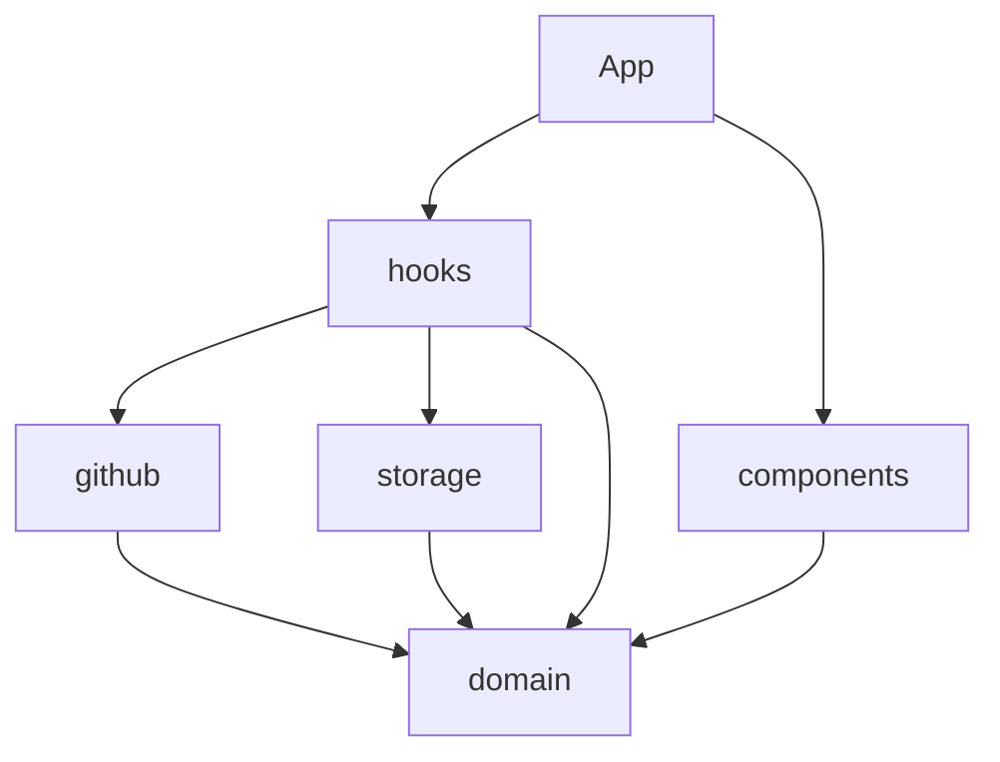

# Arquitetura — PR Network

App SPA sem backend. O browser fala direto com a GitHub GraphQL API (PRs) e a REST API (Actions); preferências e anotações ficam em `localStorage`.

## Camadas

| Pasta | Responsabilidade |
|-------|------------------|
| `domain/` | Tipos (`PullRequest`, `WorkflowRun`, `WorkspaceNote`, …) e regras puras (filtros, `prKey`, badges de run). Sem React, sem I/O. |
| `github/` | Adaptador remoto: cliente GraphQL, cliente REST, queries, Actions, branches, mappers, search/repos, PAT, parse de YAML de workflow. |
| `storage/` | Persistência local: notes (PR/Action), workspace notes, pins, layout de repos, backup, preferências UI. |
| `hooks/` | Orquestra estado React e chama `github` / `storage` / `domain`. |
| `components/` | UI apresentacional (recebe props). |
| `App.tsx` | Compõe hooks + layout shell (abas PRs / Actions / Notas). |

Dependências permitidas: UI → hooks/domain/storage; hooks → github/storage/domain; github/storage → domain. **Não** o contrário.


```mermaid
flowchart TB
  App --> hooks
  hooks --> github
  hooks --> storage
  hooks --> domain
  components --> domain
  App --> components
  github --> domain
  storage --> domain
```

## Fluxo de dados

1. Usuário salva PAT (`github/token`) → `useAuth`.
2. `usePullRequests` busca repos + PRs (`github/repos`, `github/search`) conforme escopo e filtros de API.
3. `usePrFilters` aplica filtros locais + ordenação de pins (`domain/filters`).
4. Na aba Actions, `useActions` lista runs via REST (`github/actions` / `github/rest`), carrega jobs no drawer e muta (cancel / rerun / dispatch).
5. Na aba Notas, `useLocalWorkspace` gerencia entidades `WorkspaceNote` (scratch): gerais, por repo ou por branch (nome manual + `checkRepoBranch`).
6. Lista/drawer de PRs e Actions leem notes/pins contextuais de `useLocalWorkspace` (`storage/notes`); pastas via `repoLayout`.
7. `useTheme` aplica claro/escuro em `document.documentElement` (`storage/preferences`).
8. Backup exporta/importa um JSON versionado **sem** o PAT nem o tema (`storage/backup`).

Filtros locais de PRs rodam **depois** do fetch: só enxergam PRs já carregados (incluindo páginas já pedidas com “Carregar mais”). Filtros de Actions e Notas também são locais.

Escopo Actions: `repo` e `pasta` carregam runs; `rede` pede seleção de repo/pasta (evita flood de rate limit).

Escopo Notas: `rede` = todas; `repo`/`pasta` = notas daqueles repos + gerais (chip “Só do escopo” esconde gerais).

## Chaves `localStorage`

| Chave | Conteúdo |
|-------|----------|
| `gh_pat` | Personal Access Token (nunca no backup) |
| `pr-network-notes` | Mapa de anotações de PR/Action `{ "owner/repo#n" \| "run:owner/repo#id": "texto" }` |
| `pr-network-workspace-notes` | Array de `WorkspaceNote` (aba Notas) |
| `pr-network-pins` | Array de keys `"owner/repo#n"` (PRs) |
| `gh_repo_layout` | Pastas (`parentId` para subpastas), `foldersByRepo`, `hidden` |
| `pr-network-sidebar-collapsed` | `"1"` / `"0"` |
| `pr-network-theme` | `"dark"` \| `"light"` (fora do backup) |

Layouts antigos com `folderByRepo` (um repo → uma pasta) são migrados na carga para `foldersByRepo`.

## Backup (`version: 2`)

```json
{
  "version": 2,
  "exportedAt": "ISO-8601",
  "notes": {},
  "pins": [],
  "repoLayout": { "folders": [], "foldersByRepo": {}, "hidden": [] },
  "sidebarCollapsed": false,
  "workspaceNotes": []
}
```

Importação aceita `version: 1` (preenche `workspaceNotes: []`) e `version: 2`. Substitui notes/pins/layout/sidebar/workspaceNotes. Tema e PAT não entram no arquivo.

## Decisões

- Sem servidor próprio: PAT no cliente; escopos mínimos no README (Actions: Read and write no fine-grained).
- SOLID pragmático: um módulo/hook por responsabilidade; sem container de DI.
- Testes só em lógica pura (`domain`, parse de backup, `repoLayout`, parse de workflow YAML, check de branch) — Vitest.
- Markdown na descrição do PR (e preview das notas) via `react-markdown` + GFM.
- Tema via `data-theme` + tokens CSS; preferência em `useTheme` / `storage/preferences`.
- Poll leve (~15s) na aba Actions enquanto houver runs em andamento; refresh manual no resto.
- Notas de workspace são entidades próprias (não reusam o mapa de anotações de PR/Action). Branch pode ser digitada antes do push; `GET .../branches/{branch}` promove `manual` → `verified` | `missing`.
